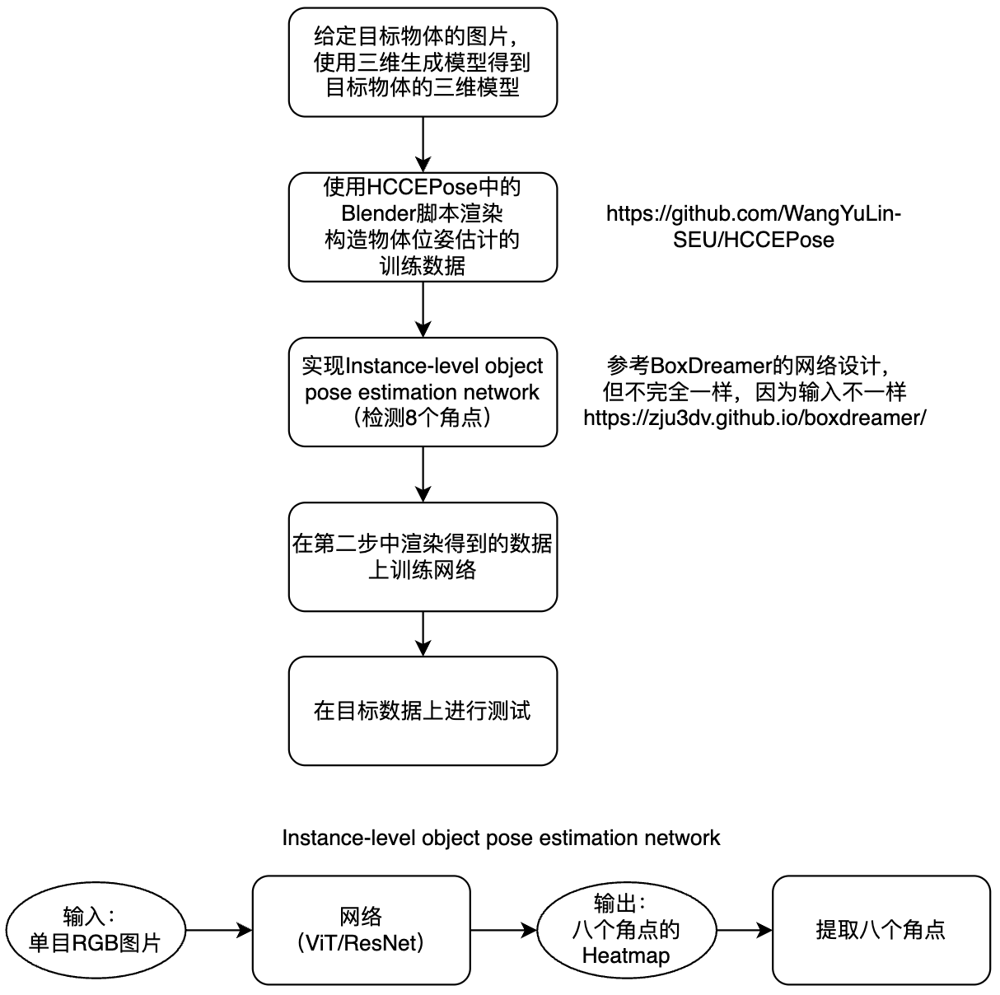

# Instance-level Object Pose Estimation Network

> 从单张 RGB 图像估计目标物体的 **6D 位姿**（3 自由度旋转 + 3 自由度平移）。
> 全流程自建：**三维模型 → 合成数据渲染 → 网络实现 → 训练 → 真实数据测试**。

<p align="center">
  
</p>

**当前状态：🚧 进行中** —— 工程骨架（Hydra + Lightning）与网络实现已完成，有自检用例覆盖；
**尚未在真实渲染数据上训练**（等阶段 ①② 的数据）。详细进度见 [§6 Roadmap](#6-roadmap)。

---

## 1. 任务概述

给定一个**目标物体**（本项目的目标物体是 **DJI Action 4** 运动相机），在**只有单目 RGB 图像、且没有真实标注数据**的条件下，估计它在相机坐标系下的 6D 位姿。

整条流水线分五步：

| 阶段 | 内容 | 产出 |
|:---:|---|---|
| **①** | 给定目标物体的图片，用三维生成模型得到目标物体的三维模型 | 带纹理 mesh（BOP 格式 `obj_000001.ply` + `models_info.json`） |
| **②** | 使用 **HCCEPose** 中的 Blender 脚本渲染构造物体位姿估计的训练数据 | BOP 格式 `train_pbr/`：RGB + GT 6D 位姿 + 相机内参 |
| **③** | 实现 instance-level object pose estimation network（检测 8 个角点） | 网络代码（单图 RGB → 8 通道角点热图） |
| **④** | 在第二步渲染得到的数据上训练网络 | 权重 + 训练曲线（**纯合成数据训练**） |
| **⑤** | 在目标数据上进行测试 | 可视化结果 + 位姿精度评估 |

### 为什么用「8 个角点」作为中间表示

直接回归旋转量在图像平面上高度非线性，精度和泛化都差。本项目采用被广泛验证的**角点中介**方案：

```
单目 RGB ──▶ 网络 (ViT / ResNet) ──▶ 8 个角点的 Heatmap ──▶ 提取 8 个角点 ──▶ solvePnP ──▶ R, t
```

- 8 个角点 = 物体 **3D 包围盒**的 8 个顶点，在物体坐标系下坐标已知（来自 `models_info.json` 的 `min`/`max`）；
- 网络预测它们在图像上的 2D 投影热图，取 soft-argmax 得到亚像素坐标；
- 得到 2D–3D 对应后用 `cv2.solvePnP` 最小二乘解出 R, t，数值上远比直接回归稳定。

> ⚠️ 被遮挡的角点**同样需要监督**（amodal 预测）——目标物体在实际场景中经常被手部 / 衣袖遮挡。

### 与 BoxDreamer 的差异

网络设计参考 [BoxDreamer](https://zju3dv.github.io/boxdreamer/)，但**输入不同，因此结构不同**：

| | BoxDreamer | 本项目 |
|---|---|---|
| 输入 | 若干参考图 + 1 张查询图 | **单张** RGB 图 |
| 是否需要 3D 模型 | 不需要（model-free） | **需要**（阶段①提供） |
| 结构 | 多视角 transformer + 跨视角注意力 | **单图** backbone（ResNet/ViT）+ 热图解码器 |

因此可复用其**角点定义、热图头、loss 与后处理**，但需去掉参考图分支与跨视角注意力。

---

## 2. 仓库结构

工程骨架**对齐 [BoxDreamer](https://github.com/zju3dv/BoxDreamer)**：Hydra 配置驱动 + PyTorch Lightning，
四层分离（入口 / 配置 / 数据 / 网络 / 训练）。砍掉了 BoxDreamer 里**多视角专有**的部分
（`modules/matcher/`、`modules/tracker/`、`sources/vggsfm/`、`three/dust3r/`、`src/reconstruction/`），
因为本项目的输入是**单张 RGB 图**。

```
.
├── run.py                                      # Hydra 统一入口（对应 BoxDreamer/run.py）
├── configs/
│   ├── train.yaml / test.yaml                  # defaults 组合各配置组
│   ├── trainer/default.yaml                    # Lightning Trainer
│   ├── model/heatmap.yaml                      # _target_: PL_CornerPose
│   ├── model/{loss,opt,metrics,vis}/default.yaml
│   ├── datamodule/bop.yaml                     # _target_: CornerPoseDataModule
│   ├── callbacks/ logger/ hydra/
├── src/
│   ├── datamodules/corner_pose_datamodule.py   # LightningDataModule
│   ├── datasets/bop_pbr.py                     # BOP PBR 读取 + 裁剪 + 热图标签
│   ├── lightning/
│   │   ├── corner_pose_lightning_model.py      # PL_CornerPose（对应 PL_BoxDreamer）
│   │   └── utils/{metrics,vis}.py
│   ├── models/
│   │   ├── CornerPoseModel.py                  # 纯 nn.Module（对应 BoxDreamerModel.py）
│   │   ├── modules/backbone/{resnet,vit}.py    # 图里的 "ResNet / ViT"
│   │   ├── modules/decoder/heatmap_head.py     # 8 通道角点热图
│   │   └── utils/{box_utils,pose_utils,prediction_utils,data_processing}.py
│   ├── loss/{loss.py, utils/focal_loss.py}     # 热图 focal loss
│   └── utils/{log.py, customize/template_utils.py}
├── tests/                                      # 自检用例（不需要数据）
├── requirements.txt / pyproject.toml
├── docs/
│   ├── REFERENCES.md                           # 参考论文 / 代码的阅读索引
│   └── TROUBLESHOOTING.md                      # 踩坑日志：每次运行遇到什么问题、怎么解决的
└── photo_of_the_project.png
```

### 与 BoxDreamer 的对应关系

| BoxDreamer | 本项目 | 说明 |
|---|---|---|
| `run.py`（Hydra 入口） | `run.py` | 同 |
| `configs/` 分层 `defaults` | `configs/` | 同 |
| `src/lightning/BoxDreamer_lightning_model.py` → `PL_BoxDreamer` | `src/lightning/corner_pose_lightning_model.py` → `PL_CornerPose` | 模块名与类名不同，避免 `import` 被遮蔽 |
| `src/datamodules/` | `src/datamodules/` | 同 |
| `src/models/BoxDreamerModel.py` | `src/models/CornerPoseModel.py` | 都是纯 `nn.Module`，不含训练逻辑 |
| `src/models/utils/box_utils.py` | 同名 | **bb8 角点顺序与 PnP 逻辑一致** |
| `src/models/modules/{backbone,encoder,matcher,tracker}` | `modules/{backbone,decoder}` | ✂️ 砍掉 `matcher` / `tracker`（多视角专有） |
| `src/models/sources/{DINOv2,vggsfm,cotracker}` | 无（DINOv2 走 `torch.hub`） | 不 vendor 第三方代码 |
| `three/dust3r`、`src/reconstruction/` | 无 | 多视角重建，本项目不需要 |

### 数据流

```
BOP train_pbr ──► BOPPBRDataset ──► 裁剪+缩放 ──► 合成数据增强
                      │
                      └─► 投影 8 个 3D 角点 ─► 热图标签 [8, h, w]

image [B,3,H,W] ──► CornerPoseModel(ResNet/DINOv2 + FPN 解码器) ──► [B,8,h,w]
                          │
                          ├─► 粗损失：整张热图 SmoothL1         ┐
                          ├─► 细损失：soft-argmax 角点 SmoothL1 ├─ L = L_coarse + 2.0·L_fine
                          │                                     ┘
                          └─► top-20 提取 ─► 2D 角点 ─► solvePnP ─► R,t   ← 推理
```

### 热图与损失：对齐 BoxDreamer 的实现细节

这几处是**照 BoxDreamer 源码临摹**的，不是通用做法，改动前请先看
[`docs/TROUBLESHOOTING.md`](docs/TROUBLESHOOTING.md) 里的 `ALGO-01` / `ALGO-02`：

| 项 | BoxDreamer 的做法 | 我们的实现 |
|---|---|---|
| 热图衰减 | `exp(-d / (s_i/10)²)`，`d` 是欧氏距离（**不是** `d²`），`s_i` 是角点 i 到物体 2D 中心的距离 | 同（`heatmap_style: 'boxdreamer'`） |
| 热图值域 | 峰值归一化到 1 后映射到 **[-1, 1]** | 同 |
| 网络输出 | `2·sigmoid(x) − 1` | 同 |
| 粗损失 | `nn.SmoothL1Loss`（**不是** focal） | 同，另保留 `focal` 作备选 |
| 细损失 | `L = L_coarse + λ·L_fine`，λ = 2.0 | 同，但用可微 soft-argmax 取角点（BoxDreamer 用单独回归头） |
| 角点提取 | **top-20 位置求平均** | 同（另提供 `soft_argmax` / `argmax`） |

> ⚠️ 两个容易踩的坑（都已实测并写进代码注释与测试）：
> 1. fine loss 的 soft-argmax 温度 `beta=1.0` 会偏 **19 像素**，必须用 **25**；
> 2. 角点贴近物体 2D 中心时原式会让热图退化成 δ 函数，使 top-k 出现大量并列、结果变成随机
>    —— 已加 `min_scale` 下限保护。

---

## 3. 数据与参考资料（**不入库**）

本仓库**不包含**原始数据与第三方代码，请自行获取：

| 资源 | 说明 | 获取方式 |
|---|---|---|
| `head_left_rgb_raw.mp4` | 目标数据：头戴左目相机第一视角视频，3248×2464 @ 29.97 fps，2850 帧（95 s），目标物体为腕戴的 DJI Action 4 | 由项目方提供（277 MB，超过 GitHub 单文件上限，故未入库） |
| BoxDreamer 论文 | ICCV 2025，8 角点热图思路来源 | [arXiv:2504.07955](https://arxiv.org/abs/2504.07955) |
| HccePose(BF) 论文 | ICCV 2025，仅借用其 Blender 渲染脚本 | [arXiv:2510.10177](https://arxiv.org/abs/2510.10177) |
| BoxDreamer 代码 | 网络设计参考 | `git clone https://github.com/zju3dv/BoxDreamer.git` |
| HCCEPose 代码 | 渲染脚本参考 | `git clone https://github.com/WangYuLin-SEU/HCCEPose.git` |

克隆到本地后统一放在 `refs/` 目录（已被 `.gitignore` 忽略）：

```bash
mkdir -p refs && cd refs
git clone --depth 1 https://github.com/zju3dv/BoxDreamer.git
git clone --depth 1 https://github.com/WangYuLin-SEU/HCCEPose.git
```

阅读顺序建议见 [`docs/REFERENCES.md`](docs/REFERENCES.md)。

---

## 4. 环境与快速开始

| 用途 | 要求 |
|---|---|
| 训练 / 推理 | Python 3.10+，PyTorch（建议 CUDA 版）、pytorch-lightning、hydra-core、OpenCV |
| 合成数据渲染 | Ubuntu + BlenderProc + `bpy` + EGL（⚠️ Windows 上通常无法运行），见 [HCCEPose](https://github.com/WangYuLin-SEU/HCCEPose) |

> 渲染环境与训练环境请使用**独立**的环境，HCCEPose 的依赖钉得较死。

```bash
# 1) 安装依赖（torch 按自己的 CUDA 版本从官方源装）
pip install -r requirements.txt

# 2) 自检：不需要任何数据，覆盖几何 / 网络 / 损失 / 配置装配
pytest tests/ -v

# 3) 看一下组合后的完整配置
python run.py --config-name=train.yaml --cfg job

# 4) 训练 / 测试
python run.py --config-name=train.yaml
python run.py --config-name=test.yaml exp_name=<实验名>
```

> 跑之前建议看一眼 [`docs/TROUBLESHOOTING.md`](docs/TROUBLESHOOTING.md)：
> 里面记录了环境、PowerShell、Hydra、Git 以及算法数值上踩过的坑（含已解决的和待解决的），
> 也包含 Windows 中文乱码、显存泄漏、标签退化这些高频问题的排查清单。

数据集路径等都可以在命令行覆盖：

```bash
python run.py --config-name=train.yaml \
    datamodule.dataset_root=/path/to/dji_action4 \
    max_epochs=100 \
    model.modules.encoder.resnet.cfg.pretrained=false
```

### Windows 中文日志乱码

Windows 控制台默认输出编码是 GBK，重定向或管道时中文会显示成乱码（源文件本身是合法 UTF-8）。
临时解决：

```powershell
$env:PYTHONUTF8=1        # 或 $env:PYTHONIOENCODING="utf-8"
```

---

## 5. 评估方式

- **定性**：将预测位姿下物体的 3D 包围盒投影回图像，检查是否贴合；
- **定量**：与真值位姿比较，报告 **ADD / ADD-S**、**5cm5°** 以及**重投影误差**。

> 目标视频若缺少位姿真值，可用 RGB-D 精修方法（如 FoundationPose / MegaPose）的输出作为伪真值进行对比。

---

## 6. Roadmap

| # | 任务 | 状态 |
|:---:|---|:---:|
| 1 | 获取目标物体 3D 模型并转换为 BOP 格式 | ⬜ 未开始 |
| 2 | 搭建 BlenderProc 渲染环境，跑通合成数据生成 | ⬜ 未开始 |
| 3 | 从 GT 位姿生成 8 角点 2D 标签 | 🟡 代码就绪，待真实数据验证 |
| 4 | 实现单图角点热图网络（含 BoxDreamer 的热图/损失配方） | 🟡 代码就绪，待真实数据验证 |
| 5 | 在渲染数据上训练（含域随机化与数据增强） | ⬜ 未开始 |
| 6 | 在目标视频上测试并可视化 | ⬜ 未开始 |
| 7 | 定量评估与误差分析 | 🟡 指标代码就绪 |
| 8 | 标定头戴相机内参 K | ⬜ 未开始（**阻塞 PnP 与评估**） |

> 「代码就绪」= 逻辑已实现并有自检用例覆盖，但还没在**真实渲染数据**上跑通。
> 当前自检规模：**42 个用例**，覆盖几何 / 角点热图 / 网络前向 / 损失 / 配置装配。

---

## 7. 参考

```bibtex
@InProceedings{yu2025boxdreamer,
  title     = {BoxDreamer: Dreaming Box Corners for Generalizable Object Pose Estimation},
  author    = {Yu, Yuanhong and He, Xingyi and Zhao, Chen and Yu, Junhao and Yang, Jiaqi
               and Hu, Ruizhen and Shen, Yujun and Zhu, Xing and Zhou, Xiaowei and Peng, Sida},
  booktitle = {Proceedings of the IEEE/CVF International Conference on Computer Vision (ICCV)},
  year      = {2025}
}

@InProceedings{HccePose_BF,
  title     = {HccePose(BF): Predicting Front \& Back Surfaces to Construct Ultra-Dense
               2D-3D Correspondences for Pose Estimation},
  author    = {Wang, Yulin and Hu, Mengting and Li, Hongli and Luo, Chen},
  booktitle = {Proceedings of the IEEE/CVF International Conference on Computer Vision (ICCV)},
  year      = {2025}
}
```

---

## 致谢

本项目的渲染流程参考 [HCCEPose](https://github.com/WangYuLin-SEU/HCCEPose)（基于 [BlenderProc](https://github.com/DLR-RM/BlenderProc)），网络设计参考 [BoxDreamer](https://github.com/zju3dv/BoxDreamer)，数据格式遵循 [BOP benchmark](https://bop.felk.cvut.cz/)。
