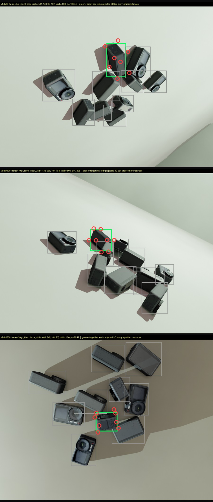
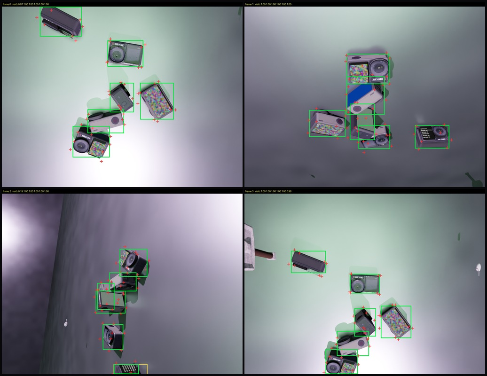
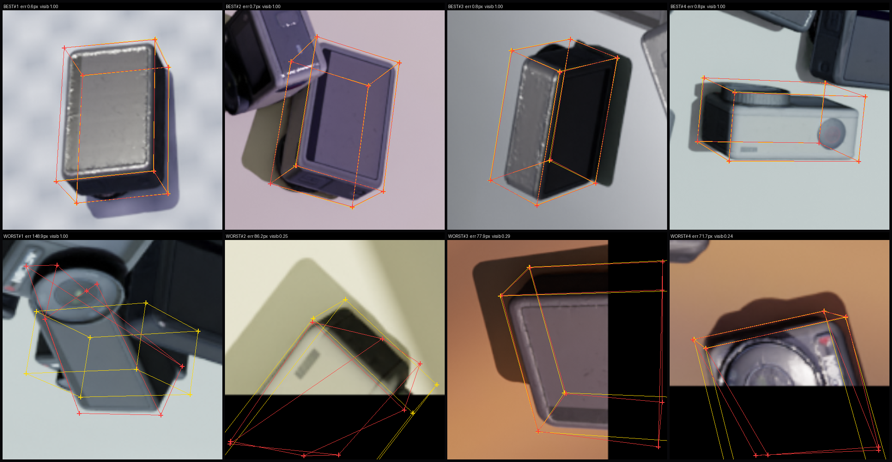

# Instance-level Object Pose Estimation Network

> 从**单张 RGB 图像**估计目标物体的 8 个 **2D 角点**（物体的 3D 包围盒顶点在图像上的投影）。
> 目标物体：**DJI Osmo Action 4** 运动相机。
> 全流程自建：**三维模型生成 → 合成数据渲染 → 网络实现 → 训练 → 真实视频测试**。
>
> **结果总览 →** [`docs/PROJECT_SUMMARY.md`](docs/PROJECT_SUMMARY.md) ｜
> **实验记录 →** [`docs/RESULTS.md`](docs/RESULTS.md) ｜
> **踩坑日志 →** [`docs/TROUBLESHOOTING.md`](docs/TROUBLESHOOTING.md) ｜
> **权重台账 →** [`docs/CHECKPOINTS.md`](docs/CHECKPOINTS.md)

<p align="center">
  
</p>

---

## 目录

- [0. 现状速览](#0-现状速览)
- [1. 交付物与评价口径](#1-交付物与评价口径)
- [2. 结果](#2-结果)
- [3. 失败模式（为什么还不行）](#3-失败模式为什么还不行)
- [4. 已证伪的假设](#4-已证伪的假设)
- [5. 与 BoxDreamer 的关系](#5-与-boxdreamer-的关系)
- [6. 仓库结构](#6-仓库结构)
- [7. 环境与快速开始](#7-环境与快速开始)
- [8. 数据从哪来（不入库）](#8-数据从哪来不入库)
- [9. 复现关键结果](#9-复现关键结果)
- [10. Roadmap](#10-roadmap)
- [11. 参考](#11-参考)

---

## 0. 现状速览

**五步流水线全部跑通并有独立验证工具佐证**，但**真实域精度还不够**。

| | |
|---|---|
| 合成测试集最佳（独立 fp32 评测） | **mean 4.12 px，PCK@0.05 96.88%**，框 IoU 0.961 |
| 真实目标视频最佳（三模型中） | **GEO7，平均 IoU 0.799** |
| ⚠️ 核心瓶颈 | **合成 → 真实的域差距**（不是网络、不是损失、不是训练时长） |
| ⚠️ 最反直觉的发现 | **合成集与真实视频的模型排名完全反转**（见 [§2.4](#24--合成集与真实视频的排名完全反转)） |

---

## 1. 交付物与评价口径

### 交付的是 **2D 角点**，不需要相机内参

网络本体只有 `image → encoder → decoder → heatmap`，损失只吃
`pred_heatmap` / GT `heatmap` / `corner_2d` —— **都不消费相机内参 K**。
K 只出现在可选的 `solvePnP` 后处理里（`configs/model/metrics/default.yaml` 默认 `solve_pose: false`）。

> 📌 **对照 BoxDreamer**：它把 K 当作**网络输入**（构造 camera rays），
> 评测时也用 K 跑 PnP —— 所以**它必须标定**，我们这条路线结构上不需要。

### 因此**不用** ADD / ADD-S / 5cm5°

那些指标需要内参跑 PnP。位姿对 **70 mm 小物体**的 2D 误差极其敏感，
会把"角点其实还行"读成"完全失败"。本项目实测踩过一次：
打开 `solve_pose` 后报出 `add = 157.84 mm`，而物体直径只有 **81 mm** ——
据此得出的"6D 位姿完全失败"是**用错标准打分**。交付物是 2D 角点，就用 2D 角点的指标。

### 实际使用的指标

| 指标 | 含义 |
|---|---|
| `corner_err_px` | 8 个角点的像素误差（256×256 裁剪坐标系），报 **median / p90 / p95**，均值会被少数崩掉的角点带偏 |
| `PCK@t` | 误差 < `t × GT 2D 框对角线` 的角点占比（消掉物体在画面里的大小差异） |
| `PCK-AUC(0~0.20)` | 把 PCK 曲线积分成一个数 |
| 失败率 | 误差 > `0.1 ×` 对角线的角点占比（部署最关心） |
| 框 IoU | 预测 8 点与 GT 8 点**各自外接框**的 IoU |

---

## 2. 结果

> ⚠️ **两种口径不能混着比**（我们为此栽过跟头）：
> **(a) 独立 fp32 评测** = 用 `scripts/eval_corners.py` 统一重评；
> **(b) 训练内联验证** = 训练日志里的 `val/corner_err_px`。
> E 系列两者几乎一致（E5：内联 17.2 / 独立 16.75），
> **但 v1 内联是 16.6、独立评测却是 4.12 —— 差 4 倍**。
> 这条异常**至今没有查清**，所以 v1 的内联数字**不能**和其他内联数字比。

### 2.1 合成测试集（独立 fp32 评测，248 样本 / 1984 角点）

| 模型 | 训练数据 | mean px | median | PCK@0.05 |
|---|---|---|---|---|
| **train_v1** | v1 | **4.12** | **1.44** | **96.88%** |
| GEO1 | GEO1 | 16.37 | — | 79.28% |
| E5（无增强 300ep） | v1 | 16.75 | 4.98 | 78.07% |
| E4（无增强 100ep） | v1 | 17.23 | 6.84 | 71.42% |
| E3b（focal + 小 fine 权重） | v1 | 18.31 | 5.61 | 74.50% |
| E2b（focal，仅粗项） | v1 | 20.72 | 6.00 | 70.72% |
| **GEO7** | GEO7 | **39.21** | 13.96 | **48.64%** |

`train_v1` 完整指标：
`PCK@0.02 94.00% / @0.05 96.88% / @0.10 97.78% / @0.15 98.29% / @0.20 98.64%`，
`PCK-AUC 0.9448`，失败率 `>0.05 3.02% / >0.10 2.22% / >0.20 1.36%`，
框 IoU `mean 0.9611 / median 0.9817`。

### 2.2 训练内联验证（只能与同口径的横向比）

| 模型 | 说明 | err px | PCK@0.05 |
|---|---|---|---|
| E7 | ResNet18 @ **224** | **14.4** | **0.771** |
| E5 | ResNet18 @ 256 | 17.2 | 0.769 |
| E4 | ResNet18 @ 256 | 18.15 | — |
| E6 | **DINOv2** @ 224 | 23.3 | 0.566 |
| GEO7 | GEO7 数据，无增强 | 46.9 | 0.441 |
| GEO8 | GEO7 数据，**有**增强 | 50.3 | 0.340 |

### 2.3 真实目标视频（手工 GT 框）

| 模型 | frame 0（2 个框） | 两帧平均 IoU |
|---|---|---|
| train_v1 | 0.487 | 0.500 |
| GEO1 | 0.606 | 0.605 |
| **GEO7** | **0.814** | **0.799** |
| MI30b（多实例，全图自行检测） | — | 0.090 |

> ⚠️ **两组数不可直接比**：单实例那一列是**框给定的**（检测免费），
> 多实例那列要**自己检测**。只有同一列内可以横向比。
> ⚠️ **证据强度**：真实视频只有 **2 个框 / 1~2 帧**的手工标注 ——
> 以下是强信号，不是定论。**目标视频目前零 GT 角点标注**，这是最大的待办。

### 2.4 🎯 合成集与真实视频的**排名完全反转**

```
合成测试集（越低越好）              真实视频（越高越好）
  v1      4.12 px   ← 最好            v1      0.500   ← 最差
  GEO1   16.37 px                    GEO1    0.605
  GEO7   39.21 px   ← 最差            GEO7    0.799   ← 最好
```

**合成集上最烂的 GEO7（差 9.5 倍），在真实视频上最好。**

原因：v1 的合成测试集与训练集**共享同一套外观统计**（同批纹理、同一屏幕、同种光照）
→ v1 过拟合到外观，合成分虚高；GEO7 用 **1923 个随机资产 + 随机屏幕内容 + 随机色温/曝光**，
逼模型学**几何**而非**外观** → 合成分暴跌，换到真实视频反而更准。

> **⇒ 合成集的绝对分数不能作为"能不能用"的判据。**

### 2.5 结果图

完整图示库（16 张，按「数据集 → 模型在数据集 → 模型在视频 → 多实例」组织）见
**[`docs/figures/`](docs/figures/README.md)**，每张图都注明该看哪里、数字从哪来。挑几张：

<p align="center">
  
</p>

*数据集 v1：**绿框** = 目标实例的 `bbox_visib`，**红圈** = 目标 8 角点按 GT 位姿投影，
**灰框** = 其他同类实例。画面里**每一个物体都是同一款 DJI** —— 这是 `DATA-27` 最直观的证据。*

<p align="center">
  
</p>

*GEO 系列（静态压盖实验）：带 GT 3D 框投影，可见**异类 Objaverse 道具**压在 DJI 上造遮挡 ——
这是"造遮挡"唯一成功的做法（料箱堆叠那版造出大量无解样本）。*

<p align="center">
  
</p>

*v1 在合成集上的最好/最差各 4 个：**上排误差 1.0~1.4 px 且 `visb=1.00`；
下排 71.7~141.9 px 且 `visb≈0.25`** —— 失败全部集中在严重遮挡样本上（§3.1 的 57 倍差距）。*

> 目标视频上的结果图（v1 / GEO7 / 多实例共 8 张）在 `docs/figures/04_*`、`06_*`、`07_*`。
> 原始视频文件（277 MB）按 `docs/DATA.md` 的约定不入库，这里放的只是结果截图。

---

## 3. 失败模式（为什么还不行）

### 3.1 遮挡：训练集里没有，所以学不会（差距 **57 倍**）

| `visib_fract` | 角点占比 | 失败率 >0.1×对角线 |
|---|---|---|
| 0.0 ~ 0.5 | 3.5% | **45.00%** |
| 0.5 ~ 0.8 | 3.7% | 27.50% |
| 0.8 ~ 0.95 | 2.5% | 0.00% |
| **0.95 ~ 1.0** | **90.2%** | **0.79%** |

被遮挡的角点必须**外推**，而训练集 90% 完全可见 → **模型从没学过外推**。
（曾试图用"料箱堆叠"硬造遮挡，结果造出 18.1% "裁剪图里没有目标"的**无解样本**，
整版数据作废 —— 见 `docs/RESULTS.md` §11。）

### 3.2 预测出的 8 个角点**不构成长方体投影**

合法长方体投影的必要条件之一是**四条深度棱汇聚于同一消失点（夹角 < 10°）**。实测：

| 模型 | 深度棱最大夹角 | 长度比 | 合法？ |
|---|---|---|---|
| train_v1 | 78.0° / 82.1° | 5.08 / 2.56 | ❌ |
| GEO1 | 72.1° / 87.8° | 1.65 / 3.69 | ❌ |
| GEO7 | 89.9° / 85.1° | 10.39 / 5.91 | ❌ |
| 手工构造的合法投影 | **0.0°** | 1.00 | ✅ |

**根因是架构**：网络输出 8 张热图，**每个角点各自取最大值**，
损失也是逐角点的 `Σ‖pred_i − gt_i‖` ——
**没有任何一项在问"这 8 个点合起来像不像一个盒子"。**

> ⇒ 我们训练的是**「8 点检测器」**，不是**「位姿估计器」**。
> 在训练分布内靠记忆能蒙对；某个角点被遮挡或外观陌生时，
> **没有任何机制把它拉回到其余 7 点所暗示的盒子上。**

### 3.3 渲染场景里**每一个物体都是同一款 DJI**（`DATA-27`）

`models_info.json` 里只有 `obj 1`，而摆放是
`np.random.choice(models_ids, size=num_objs, replace=True)` ——
**v1 每帧 10 个、GEO7 每帧 6 个，全是同一款 DJI**，异类物体只有 3 个道具。

实测 1.4× 裁剪框内含其他同类实例的比例：**v1 96.2% / GEO7 77.6%**。

> ⚠️ 但"这会让标签歧义"是**错的** —— 量了"选离裁剪中心最近的那台"这个位置捷径，
> **GT 框上 99.92% 正确，框偏移 ±25% 时仍有 92~97% 正确**。
> 所以目标是可判定的。改它的真正理由是：
> ① 模型可走捷径而不学外观 ② 裁剪里从来没有"非 DJI 物体"（背景统计 == DJI 统计）
> ③ 遮挡永远是同类自遮挡。

### 3.4 训练时增强是**负收益**（`ALGO-11`）

同数据、同划分、同代码，只差增强，同 epoch 对比：

| epoch | GEO7（无增强） | GEO8（有增强） |
|---|---|---|
| 44 | 44.54 px / 0.404 | 52.80 / 0.302 |
| 89 | **45.64 / 0.423** | **50.62 / 0.342** |
| 299（终） | **46.87 / 0.441** | —（epoch 136 停） |

**增强臂全程落后 10~25%，从未追上。** 这与"照抄 BoxDreamer 增强强度全线变差"是同一现象。

### 3.5 其他

- **真实视频零 GT** → "有没有变好"无法量化（最大待办）
- **真实目标与渲染不一致**：真实目标**屏幕点亮**且**贴有 QR 标签**，我们渲染的是干净模型
- `DATA-17`：裁完 256×256 有 1.5~2.4× 上采样，有效分辨率偏低
- `DATA-14`：训练集 `depth/` 实际不可用（训练不用；做 RGB-D 时需修）

---

## 4. 已证伪的假设

这一节和结果同样重要 —— 它划掉了错误的排查方向。

| 假设 | 实测结论 | 判定 |
|---|---|---|
| 损失函数是杠杆 | 四种配置（fine 权重、focal、仅粗项）在 100 epoch 下**不可区分** | ❌ |
| 训练时长不够 | 300 epoch 只有 16.75（v1 是 4.12），只比 100 ep 好 0.5 px | ❌ |
| 角点提取方式 | `soft_argmax` 15.82 vs `topk(20)` 15.99 vs `argmax` 17.29 —— 差 0.2 px | ❌ |
| **主干换 DINOv2** | E6(DINOv2@224) 23.3 vs E7(ResNet18@224) **14.4 —— 更差**；结构性原因：ViT-B/14 在 224 下每 token 16 px | ❌ |
| 输入尺寸 256 → 224 | E7(224) 14.4 **好于** E5(256) 17.2 | ✅ 略有效 |
| BoxDreamer 式增强有益 | 同 epoch 全程落后 10~25% | ❌ **有害** |
| 几何一致性损失是元凶 | `geo_weight` 0 vs 1 逐项差 3~6%（噪声） | ❌ 无关 |
| 料箱堆叠能造遮挡 | 造出 18.1% 无解样本，训练完全不收敛 | ❌ |

**⇒ 唯一有效的方向是「数据的外观多样性」。**

---

## 5. 与 BoxDreamer 的关系

网络设计参考 [BoxDreamer](https://zju3dv.github.io/boxdreamer)（ICCV 2025），
工程骨架（Hydra + PyTorch Lightning）也与其对齐。但**输入不同，因此结构不同**：

| | BoxDreamer | 本项目 |
|---|---|---|
| 输入 | 若干**参考图** + 1 张查询图 | **单张** RGB 图 |
| 3D 模型 | **不需要**（model-free） | **需要**（阶段①提供 CAD 盒） |
| 3D 盒子从哪来 | 参考帧 **DUSt3R/COLMAP 重建**点云的轴对齐包围盒 | `models_info.json` 里 CAD 的轴对齐包围盒 |
| 结构 | 多视角 transformer + 跨视角注意力 | 单图 backbone（ResNet18）+ 热图解码器 |
| 相机内参 | **必须**（网络输入 + PnP） | **不需要** |
| 参数量 | 88.6 M（+ 冻结 DINOv2） | **12.0 M** |
| 检测 | GroundingDINO + SAM2 | 复用其检测路径（省掉 SAM），或手工框 |

**可复用**：角点定义（BB8 顺序一致）、热图头配方、损失配方、后处理、检测代码路径。
**必须去掉**：参考图分支、跨视角注意力、`three/dust3r/`、`src/reconstruction/`。

### 热图与损失：照 BoxDreamer 源码临摹的几处

| 项 | BoxDreamer | 本项目 |
|---|---|---|
| 热图衰减 | `exp(-d / (s_i/10)²)`，`d` 是欧氏距离（**不是** `d²`） | 同（`heatmap_style: 'boxdreamer'`） |
| 热图值域 | 峰值归一化到 1 后映射到 **[-1, 1]** | 同 |
| 网络输出 | `2·sigmoid(x) − 1` | 同 |
| 粗损失 | `SmoothL1Loss`（**不是** focal） | 同，另保留 `focal` 备选 |
| 细损失 | `L_coarse + λ·L_fine`，λ = 2.0 | 同，但用**可微 soft-argmax**（BoxDreamer 用单独回归头） |
| 角点提取 | top-20 位置求平均 | 同（另提供 `soft_argmax` / `argmax`） |

> ⚠️ 两个已实测的坑：soft-argmax 温度 `beta=1.0` 会偏 **19 px**（须用 **25**）；
> 角点贴近物体 2D 中心时原式会让热图退化成 δ 函数，使 top-k 大量并列 —— 已加 `min_scale` 下限。

---

## 6. 仓库结构

工程骨架对齐 BoxDreamer：**Hydra 配置驱动 + PyTorch Lightning**，五层分离
（入口 / 配置 / 数据 / 网络 / 训练）。

```
.
├── run.py                                  # Hydra 统一入口
├── configs/
│   ├── train.yaml / test.yaml / train_multi.yaml
│   ├── trainer/ model/{heatmap,multi_instance}/ datamodule/ callbacks/ logger/ hydra/
├── src/
│   ├── datamodules/corner_pose_datamodule.py    # 支持多路径数据根
│   ├── datasets/
│   │   ├── bop_pbr.py                           # BOP 读取 + 裁剪 + 角点热图标签
│   │   └── utils/{aug_boxdreamer,aug_geo_first,objaverse_props,screen_planes,screen_content}.py
│   ├── lightning/
│   │   ├── corner_pose_lightning_model.py       # 单实例
│   │   └── multi_instance_lightning_model.py    # 多实例（中心热图 + 角点偏移）
│   ├── models/
│   │   ├── CornerPoseModel.py
│   │   ├── modules/backbone/{resnet,vit}.py
│   │   ├── modules/decoder/heatmap_head.py      # 8 通道角点热图 / 1 通道中心热图
│   │   └── utils/{box_utils,pose_utils,prediction_utils,data_processing,box_fit,multi_instance}.py
│   └── loss/{loss.py, utils/{focal_loss,geo_consistency,multi_instance_loss}.py}
├── scripts/
│   ├── mesh_to_bop.py                  # .glb -> BOP PLY（保纹理简化 / 压小文本）
│   ├── verify_{bop,dataloader,pnp}.py  # 三条独立自检：标注投影 / 热图峰 / PnP 往返
│   ├── eval_corners.py                 # ⭐ 统一口径的角点评测（含遮挡分层）
│   ├── eval_{best_worst,multi_best_worst}.py
│   ├── demo_video{,_gdino,_track,_multi}.py     # 真实视频推理
│   ├── detect_grounding_dino.py                 # 开放词汇检测（复用 BoxDreamer 路径）
│   ├── render_single_instance.sh                # ⭐ 单实例版数据渲染（1 DJI + 多道具）
│   ├── analyze_instance_ambiguity.py            # 量化裁剪污染与位置捷径
│   ├── diag_{dataload,throughput,dm}.py         # 数据加载诊断
│   ├── merge_bop_roots.py / merge_bop_shards.py
│   ├── make_video_result_sheets.py              # 结果拼图（PPT 复用）
│   ├── qa_scene.py                              # 单场景质检门（PASS/FAIL + 退出码）
│   └── remote.py                                # 云端实例操作
├── tests/                                       # 84 个自检用例（不需要数据）
└── docs/                                        # 见下方文档索引
```

### 文档索引

| 文档 | 内容 |
|---|---|
| [`PROJECT_SUMMARY.md`](docs/PROJECT_SUMMARY.md) | ⭐⭐ **结果总览：做到了什么 / 瓶颈在哪 / 下一步** |
| [`RESULTS.md`](docs/RESULTS.md) | 全部实验（按实验组织，含被证伪的假设与五次实验设计错误） |
| [`TROUBLESHOOTING.md`](docs/TROUBLESHOOTING.md) | 踩坑日志：50+ 条问题定位记录 |
| [`CHECKPOINTS.md`](docs/CHECKPOINTS.md) | 产物台账：每个权重的指标 / 位置 / 恢复步骤 |
| [`TRAINING.md`](docs/TRAINING.md) | 网络设计、集成验证结论、怎么跑 |
| [`DATA.md`](docs/DATA.md) / [`DATASET_v1.md`](docs/DATASET_v1.md) | 数据放哪、从哪来、许可、验收 |
| [`RENDER_SETUP.md`](docs/RENDER_SETUP.md) / [`CLOUD_SETUP.md`](docs/CLOUD_SETUP.md) | 渲染与云端环境（含踩坑，可复现） |
| [`MODEL_REGEN.md`](docs/MODEL_REGEN.md) | 目标物体 3D 模型生成（4 视图，三轴 99%/102%/101%） |
| [`REFERENCES.md`](docs/REFERENCES.md) | 参考论文 / 代码的阅读索引 |

---

## 7. 环境与快速开始

| 用途 | 要求 |
|---|---|
| 训练 / 推理 | Python 3.10+，PyTorch（建议 CUDA 版）、pytorch-lightning、hydra-core、OpenCV |
| 合成数据渲染 | Ubuntu + BlenderProc + `bpy` + EGL（⚠️ Windows 上通常无法运行），见 [HCCEPose](https://github.com/WangYuLin-SEU/HCCEPose) |

> 渲染环境与训练环境请用**独立**的环境（HCCEPose 的依赖钉得较死）。
> 实测训练速度：RTX 4090 单卡，**6.9 步/s**（batch 16 / bf16-mixed）。

```bash
# 1) 安装依赖（torch 按自己的 CUDA 版本从官方源装）
pip install -r requirements.txt

# 2) 自检：不需要任何数据
pytest tests/ -v

# 3) 看一眼组合后的完整配置
python run.py --config-name=train.yaml --cfg job

# 4) 训练 / 测试
python run.py --config-name=train.yaml exp_name=my_exp \
    datamodule.dataset_root=/path/to/dji_action4
python run.py --config-name=test.yaml exp_name=test pretrain_name=my_exp
```

> ⚠️ 跑之前建议扫一眼 [`docs/TROUBLESHOOTING.md`](docs/TROUBLESHOOTING.md) 的**快速排查清单**
> （30 条，含 Hydra 配置解析、非 TTY 下日志不输出、进程自匹配、git 静默失败等高频坑）。

**Windows 中文日志乱码**：控制台默认 GBK，重定向时中文会乱码（源文件本身是合法 UTF-8）：

```powershell
$env:PYTHONUTF8=1
```

---

## 8. 数据从哪来（不入库）

本仓库**不包含**原始数据、渲染产物与第三方代码（体积 + 版权）：

| 资源 | 说明 | 获取方式 |
|---|---|---|
| 目标视频 | 头戴左目相机第一视角，3248×2464 @ 29.97 fps，2850 帧 | 由项目方提供（277 MB，超 GitHub 单文件上限） |
| BoxDreamer | 8 角点热图与网络设计来源 | [arXiv:2504.07955](https://arxiv.org/abs/2504.07955) · [代码](https://github.com/zju3dv/BoxDreamer) |
| HCCEPose(BF) | 仅借用其 Blender 渲染脚本 | [arXiv:2510.10177](https://arxiv.org/abs/2510.10177) · [代码](https://github.com/WangYuLin-SEU/HCCEPose) |

```bash
mkdir -p refs && cd refs
git clone --depth 1 https://github.com/zju3dv/BoxDreamer.git
git clone --depth 1 https://github.com/WangYuLin-SEU/HCCEPose.git
```

所有原始数据放在 `data/`（整个目录已被 `.gitignore` 忽略）：

```
data/
├── raw/{target_video,web_views,official}/
├── cc0textures-512/                       # 渲染用表面纹理
└── dji_action4/
    ├── camera.json                        # ⚠️ 必须手写，否则脚本会填 LINEMOD 默认内参
    ├── models/{obj_000001.ply, models_info.json}
    └── train_pbr/                         # 渲染产出（BOP 格式）
```

**每个目录放什么、数据从哪来、许可、脚本里哪些硬编码要改，全部在
[`docs/DATA.md`](docs/DATA.md)。**

> 目标物体 3D 包围盒：**69.94 × 44.87 × 33.09 mm**，`models_info.json` 的 `min/max` = ±34.97 / ±22.435 / ±16.545。

---

## 9. 复现关键结果

```bash
# ---- 训练（阶段④）----
python run.py --config-name=train.yaml exp_name=GEO8 \
    datamodule.dataset_root=<GEO7 BOP 根> \
    heatmap_style=boxdreamer model.loss.heatmap_loss=smooth_l1 model.loss.fine_weight=2.0 \
    precision=bf16-mixed datamodule.num_workers=8 datamodule.batch_size=16 \
    trainer.max_epochs=300 trainer.accelerator=gpu trainer.devices=1

# ---- 统一口径评测（阶段⑦）----
python scripts/eval_corners.py pretrain_name=train_v1 \
    datamodule.dataset_root=<数据集根> datamodule.max_val_samples=1000
#   输出：像素误差分位 / PCK@t / PCK-AUC / 失败率 / 框 IoU / 逐角点拆解 / 按遮挡分层

# ---- 真实视频推理（阶段⑤）----
python scripts/demo_video_gdino.py +demo_out=<输出目录>          # GroundingDINO 出框 -> 网络出角点
python scripts/demo_video.py                                     # 手工框
python scripts/make_video_result_sheets.py --dir <video_eval 目录> --models train_v1 GEO1 GEO7

# ---- 数据质检 ----
python scripts/qa_scene.py --dataset-root <场景目录> --ckpt train_v1
python scripts/analyze_instance_ambiguity.py --root <数据集根> --jitter 0.2

# ---- 单实例版数据渲染（需 GPU）----
bash scripts/render_single_instance.sh smoke     # 2 场景冒烟：先验证再全量
bash scripts/render_single_instance.sh main      # 45 场景 x 20 帧，每帧 1 个 DJI + 10 个异类道具
```

### 关键超参

| | |
|---|---|
| 分辨率 | 输入 256×256 裁剪，热图 64×64（`image_size/4`） |
| 裁剪 | `crop_scale=1.4`，`use_gt_crop=true`（用 GT 框裁，GT 框外扩） |
| 损失 | `L = 1.0·SmoothL1(heatmap) + 2.0·SmoothL1(soft_argmax(heatmap), corner_2d)` |
| 优化 | AdamW，batch 16，bf16-mixed，`gradient_clip_val=1.0` |
| 可见性过滤 | `min_px_visib=64`，`min_visib_fract=0.10`（裁出退化框的实例是纯噪声，必须滤） |

---

## 10. Roadmap

| # | 任务 | 状态 |
|:---:|---|---|
| 1 | 目标物体 3D 模型 → BOP 格式 | ✅ 4 视图生成，三轴 99%/102%/101% 对官方尺寸 |
| 2 | BlenderProc 渲染环境 + 合成数据 | ✅ v1 500 帧/5000 实例；GEO7 700 帧/4200 实例 |
| 3 | 从 GT 位姿生成 8 角点 2D 标签 | ✅ 重投影一致，热图峰 **0 格**误差 |
| 4 | 单图角点热图网络 | ✅ ResNet18 + FPN，**12.0 M** 参数 |
| 5 | 合成数据训练 | ✅ v1 / GEO1 / GEO7 / E0~E7 / GEO8 |
| 6 | 目标视频测试与可视化 | ✅ 端到端跑通（检测→角点），有结果图 |
| 7 | 定量评估 | 🟡 合成集有独立 fp32 评测；**真实视频仍无 GT 标注** |
| 8 | ~~标定头戴相机内参 K~~ | ✅ **本项目不需要**（网络与损失都不消费 K） |
| 9 | **压域差距** | ⬜ **下一步**：渲染对齐真实外观（屏幕点亮 + 目标贴标签） |
| 10 | **单实例数据设计** | ⬜ 已量化并写好渲染脚本（`BP_NUM_OBJS=1` + 10 个异类道具），**待 GPU 渲染** |
| 11 | 给角点加几何约束 | ⬜ 现在结构上不可能输出合法长方体（见 §3.2） |
| 12 | 多实例（一图多台自行检测） | 🟡 架构端到端跑通（recall 0.828 / err_matched 6.23 px），但**真实帧上中心热图不响应**（峰值 0.17） |

### 下一步优先级（按性价比）

| 优先级 | 事项 | 理由 |
|---|---|---|
| **1** | **渲染时对齐真实外观**：屏幕点亮、贴标签/磨损 | 真实目标屏幕亮且贴 QR 标签，我们渲的是干净模型 —— 唯一直接针对域差距的动作 |
| **2** | 同一批渲染里改数据设计：`BP_NUM_OBJS=1` + 10 个异类道具 | 去掉位置捷径、让模型见到异类物体（§3.3）。**和 ① 是同一次渲染** |
| **3** | 给真实视频建 GT（哪怕 8~10 帧） | 现在零标注，"有没有变好"无法量化 |
| **4** | 给角点加几何约束 | 修 §3.2 |
| **5** | 关掉增强、改用 224 输入 | 两者都有实测依据，改配置即可 |

---

## 11. 参考

```bibtex
@InProceedings{yu2025boxdreamer,
  title     = {BoxDreamer: Dreaming Box Corners for Generalizable Object Pose Estimation},
  author    = {Yu, Yuanhong and He, Xingyi and Zhao, Chen and Yu, Junhao and Yang, Jiaqi
               and Hu, Ruizhen and Shen, Yujun and Zhu, Xing and Zhou, Xiaowei and Peng, Sida},
  booktitle = {Proceedings of the IEEE/CVF International Conference on Computer Vision (ICCV)},
  year      = {2025}
}

@InProceedings{HccePose_BF,
  title     = {HccePose(BF): Predicting Front \& Back Surfaces to Construct Ultra-Dense
               2D-3D Correspondences for Pose Estimation},
  author    = {Wang, Yulin and Hu, Mengting and Li, Hongli and Luo, Chen},
  booktitle = {Proceedings of the IEEE/CVF International Conference on Computer Vision (ICCV)},
  year      = {2025}
}
```

---

## 致谢

渲染流程参考 [HCCEPose](https://github.com/WangYuLin-SEU/HCCEPose)（基于
[BlenderProc](https://github.com/DLR-RM/BlenderProc)），网络设计与工程骨架参考
[BoxDreamer](https://github.com/zju3dv/BoxDreamer)，数据格式遵循
[BOP benchmark](https://bop.felk.cvut.cz/)，干扰物素材来自 Objaverse，表面纹理来自 CC0 Textures。

> 📌 本仓库**不包含** `LICENSE`。如需开源授权（如 MIT / Apache-2.0），请先补上。
