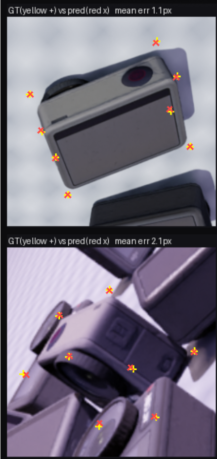
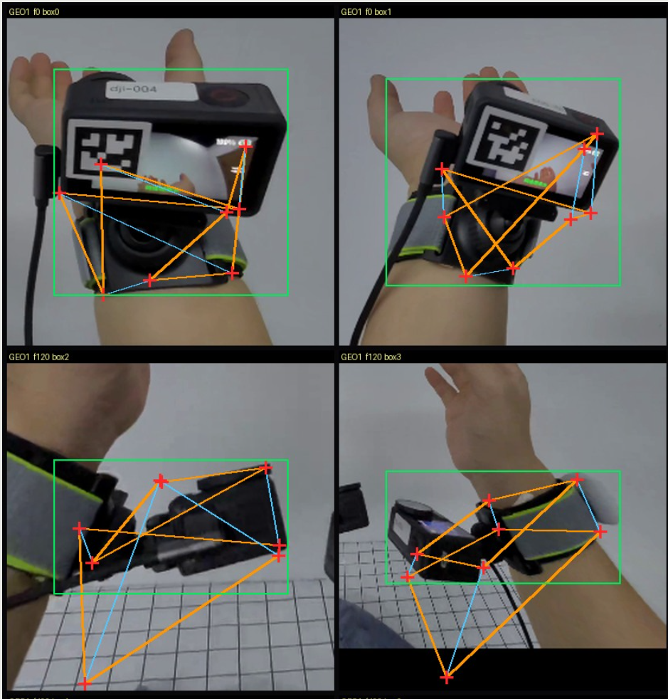

# 实验记录
本文件由人类所有，llm不得改动。
## 20260912
目前已大致了解题目要求。现在打算先把DJI action4的3d模型重建出来。数据集是DJI测评的几张图片，但是待测视频里的DJI是带壳的，找到的数据中带壳的比较少，不带壳的比较多。打算先把不带壳的重建了。然后仔细研读boxdreamer,了解后续。
那么重建需要用什么模型？colmap还是nerf/3dgs？我感觉是comlap，不过得看hccepose的blender需要什么。
原来视频里DJI是不带壳的。那就没什么好说的了。
第一个步骤说给定目标物体图片，用3D生成模型得到目标物体的3D模型。这句话有点问题，应当询问Mr.Peng。
好了没什么问题，生成模型在输入只有4-10张时占主导。
## 20260917
现在agent做的有点乱。
数据做了两版，v1在linux上训的，v2在windows上训的，ai说windows上训的有点问题。
已经训练出的v1模型在测试集上效果还可，但是到目标视频里的效果就是很差，角点预测得一坨。
训出的v2的效果很烂，应该是数据在windows上渲染的原因。
接下来的方向：(1) 重新渲染v2 （2）让训练和目标视频有些联系
## 20260918
目标视频还有一个问题，就是GT没法标。那怎么办？
目标视频有贴纸，而且正在拍摄画面，表面纹理和实际差别很大，那是不是要重几何轻外观？
重几何轻外观不好做，agent把光照调了一下就说做到重几何轻外观了，结果还是很差。
## question psd
前面训了一堆模型，效果没有很好。网络结构应该是没什么问题，后面把Resnet换成DINOv2后还是没什么改变。数据集可能有比较大的问题。我在DJI官网找了同一个DJI action4的几个角度的照片，生成出很像样的DJI三维模型。目标视频的DJI处于拍摄状态，屏幕和我渲染出的DJI不一样，而且目标视频的DJI还贴有标签。训练出的模型在给定数据集的效果还行，除了严重遮挡预测效果比较差以外都还好，但是迁移到目标视频上就不行了。而目标视频的GT标注又貌似不好获得，可以用boxdreamer预测出角点来做标签？

此处需要三张图片：重建出的DJI模型，v1在数据集的测试结果，v1在目标视频的测试结果。

## 20260919
对于数据集和目标视频效果差别过大的情况，老师说是训练数据和真实场景差别过大。
处理屏幕和在场景里摆放物体？成本似乎很大。